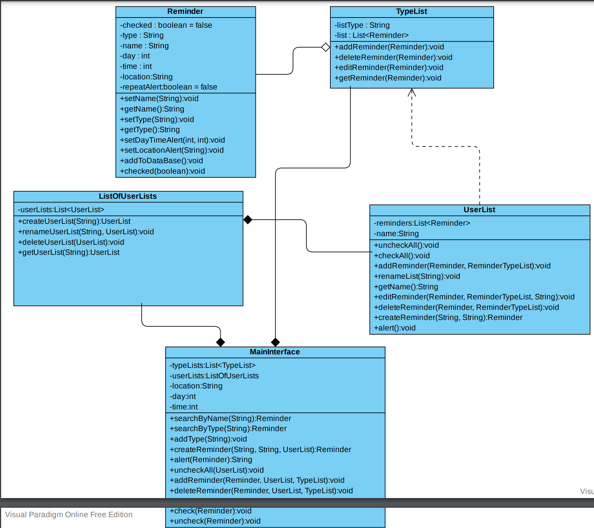
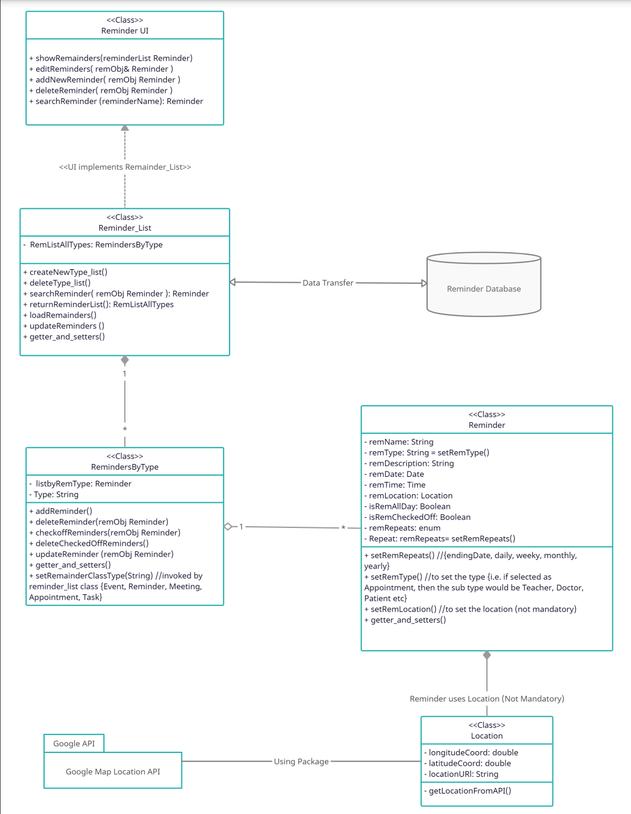
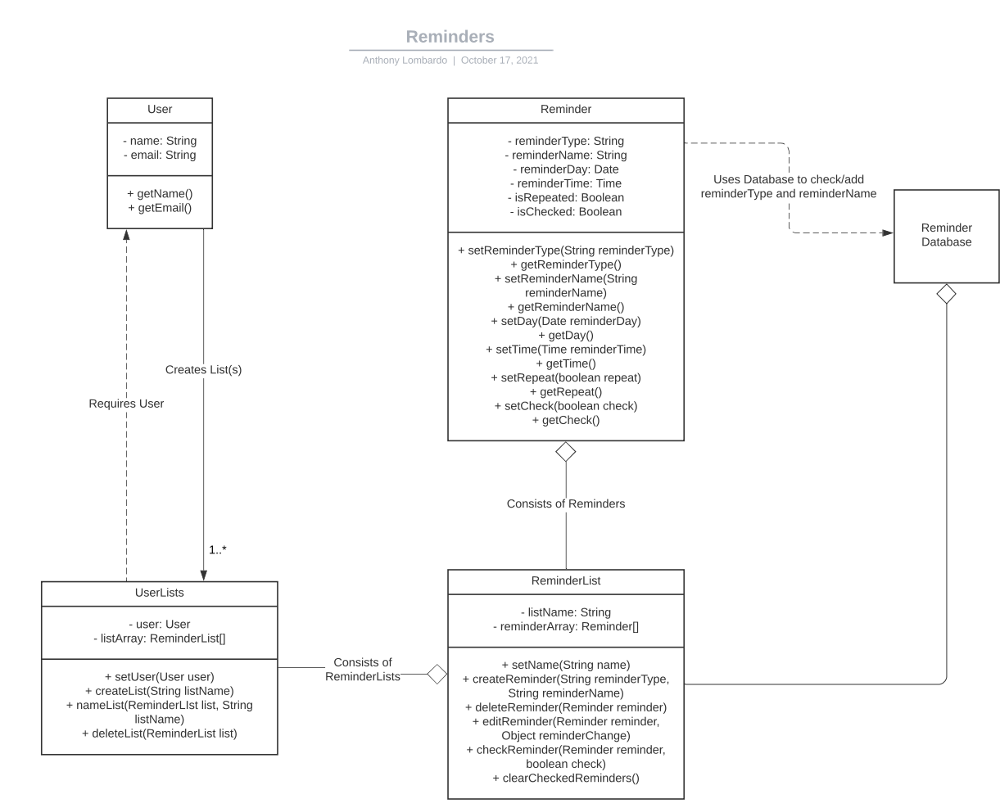
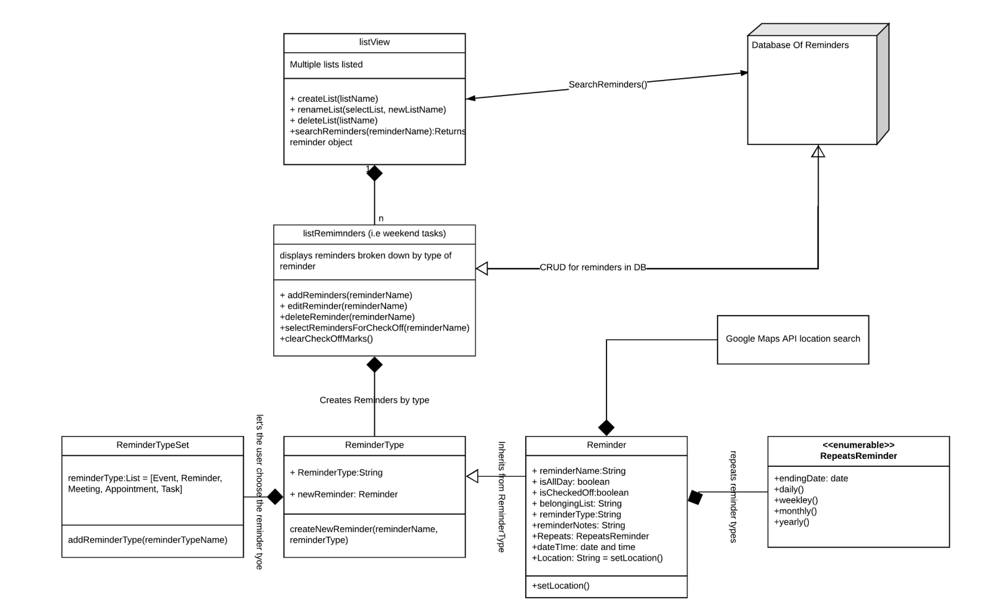
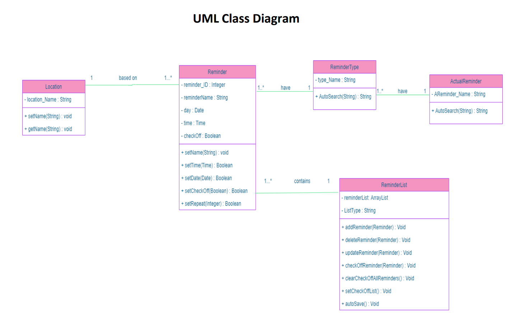
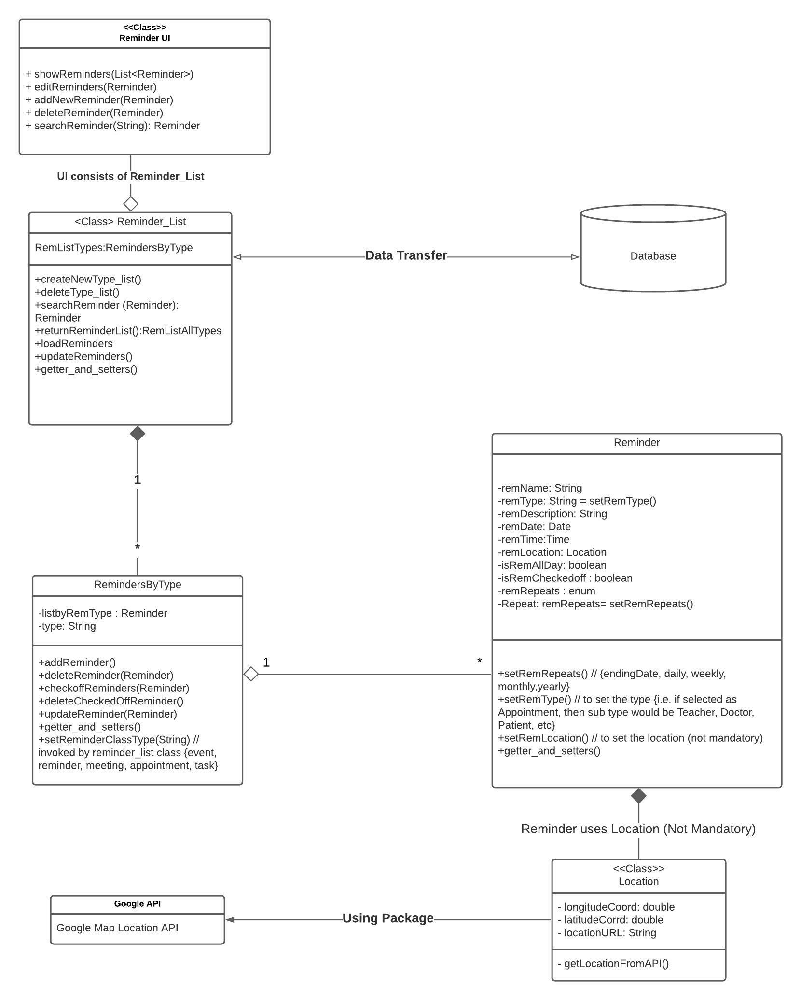

# Individual Designs

### Design 1 - Alex Perinetti

Pros
1. Covers all requirements.

Cons
1. No database indicated.

### Design 2 - Jahed Ahmed

Pros
1. Indicates relationship between classes.
2. Includes Google Map API.

Cons
1. Missing some setters and getters

### Design 3 - Anthony Lombardo

Pros
1. Allows multiple users.

Cons
1. No sure where reminders are being received from.

### Design 4 - Tania Chowdhury

Pros
1. Includes Google Map API
2. listReminders class

Cons
1. No setters and getters

### Design 5 - Tanvir Khan

Pros
1. Includes ID for reminders

Cons
1. No database
2. Missing some variables and dependency arrows

# Team Design

Commonalities
1. Database implementation
2. Reminder type lists
3. Location is a class using the Google API
4. Creation of lists and reminders done through an interface class
5. remRepeats uses enum type
6. Relationship between classes specified

Differences
1. No implementation for multiple users
2. No class for type names
3. No list of lists class

ReminderUI class allows the user to create Reminders and Reminder_Lists. Reminder_List allows for new types to be created and interacts with the Database. RemindersByType lists out the reminders in a heirarchical list based on type. The Reminder class allows for Day and Time to be set for repeating reminders. The Location class interacts with Google Maps API to implement location based reminders. 

# Summary

1. Keep design concise and clear.
2. We were able to learn from each other's designs to make the team design to the point of the requirements.
3. Using each other's feedback helped improve out team design.
4. We learned to collaborate together, using everyone's ideas.
5. Through the UML design we learned that the small details are really important.
6. Everyone had different ideas, and it was hard to come up with one specific design.