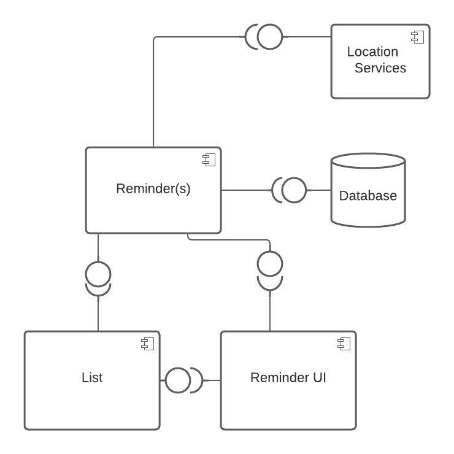
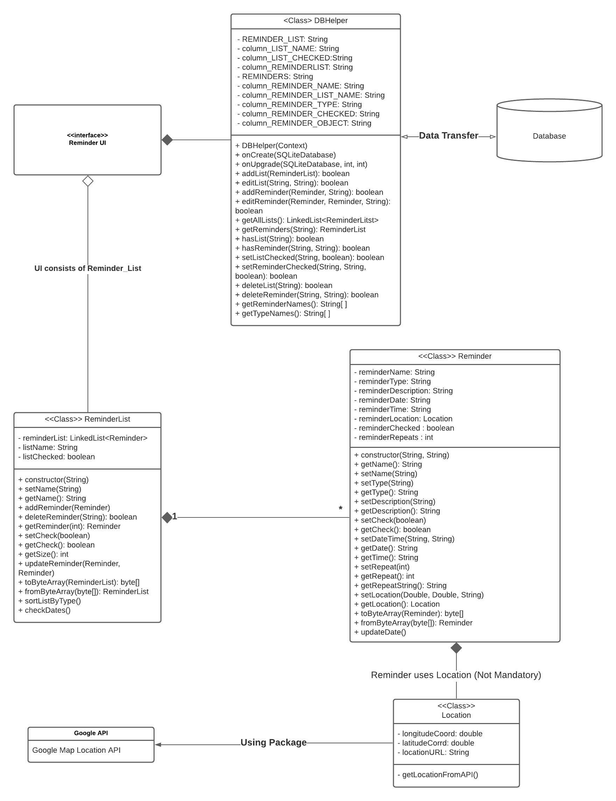
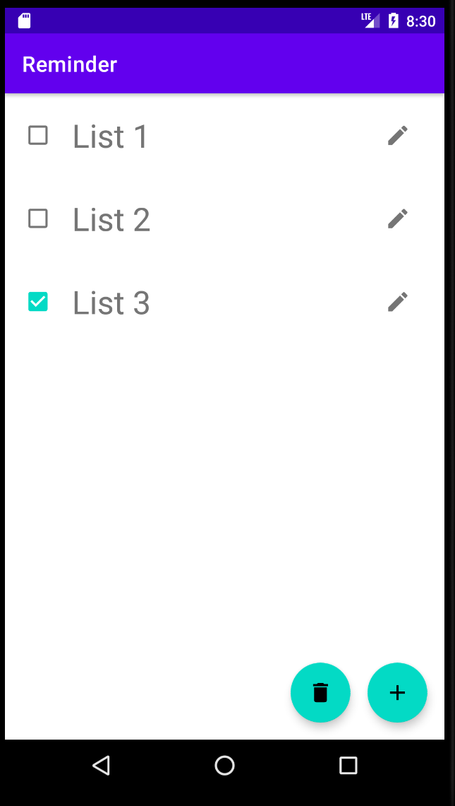
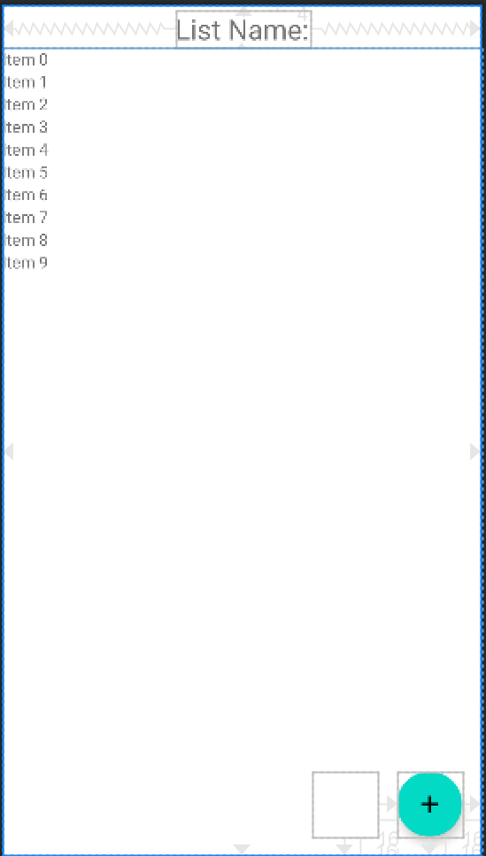
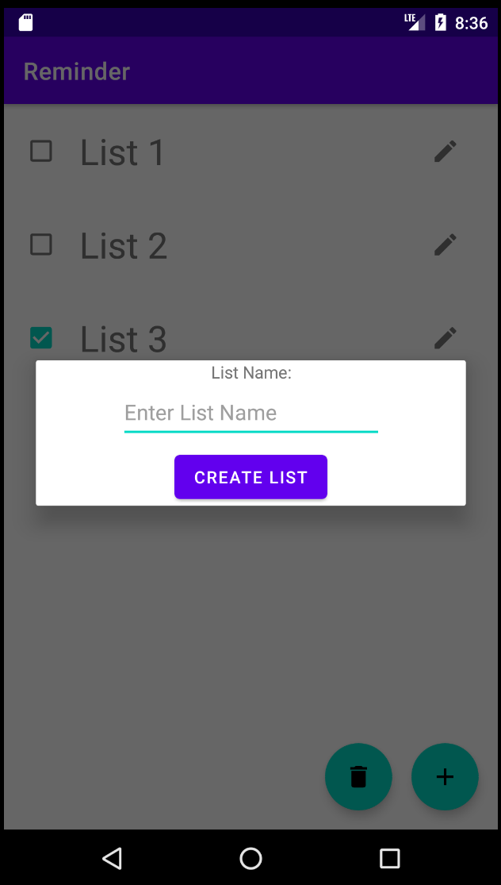
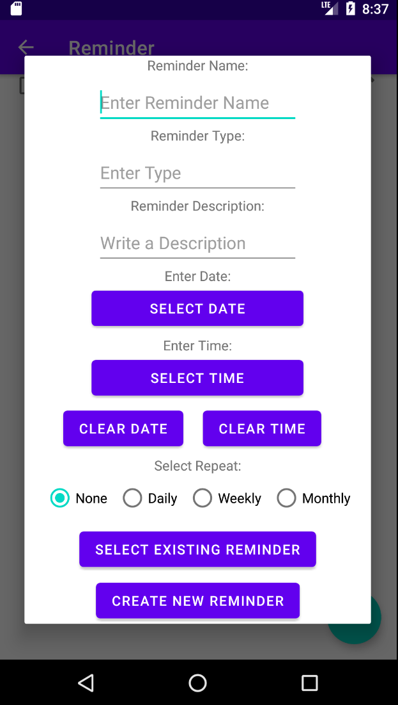
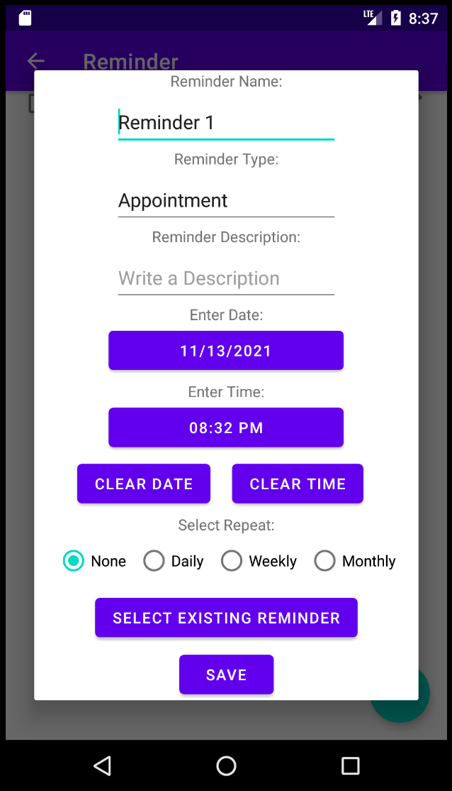
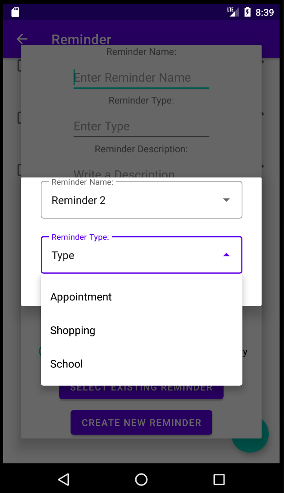
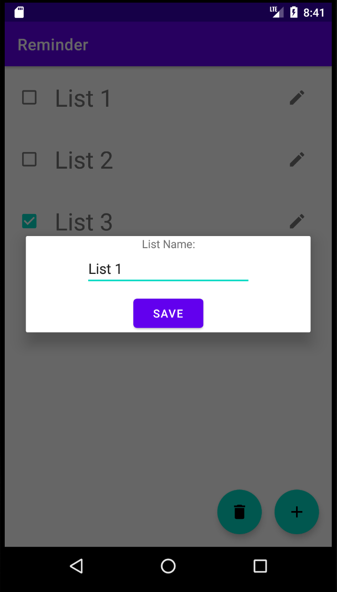
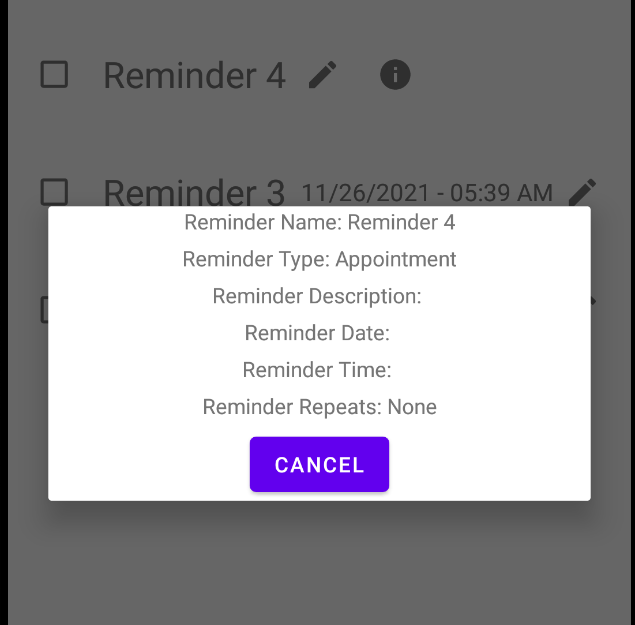

# Design Document

**Author**: Group 4
**Version**: 2

## 1 Design Considerations

### 1.1 Assumptions

 - The project will only run on Android devices
 - Will be used to create reminders
 - Every reminder will have a type
 - Each type has a list containing all reminders of that type
 - Any reminder or user-made list can be deleted

### 1.2 Constraints

 - The project will only be available on one platform (Android)
 - The application cannot take up that much storage since it is on a mobile device
 - The application cannot take up to many Android system resources at once
 - Screen size should be considered, it should be adaptable
 - Wifi/Data use should be limited (location), and disabled when not in use

### 1.3 System Environment

 - The software will operate on Adroid OS
 - The app will be created using Android Studio
 - The code will be in Java
 - The app may interact with the location feature on the Android device
 - The code will interact with a local database

## 2 Architectural Design

### 2.1 Component Diagram

 - Reminders: The reminders that will be created in the program.
 - List: The lists that will be made up of the reminders, it uses the reminders to make the lists.
 - Database: Stores the reminders after their creation. The Reminder uses its services to store a new reminder when it is created.
 - Location Services: Tracks location of the device. The Reminder uses it if a reminder has the location option selected.
 - Reminder UI: The user can create Lists and Reminders. Reminder UI uses the List and Reminder components' services.

### 2.2 Deployment Diagram

Since we are only deploying to the Android device, and the database will be local, there is no need for a Deployment Diagram.

## 3 Low-Level Design

### 3.1 Class Diagram

### 3.2 Other Diagrams

No other diagrams at this time.

## 4 User Interface Design

The main page of the application.

Viewing the reminders in a list.

Adding a new list to the program.

Adding a new reminder.

Editing an existing reminder.

Use existing reminders to fill in the name and type fields.

Edit the name of an existing list.

View the details of a reminder.
