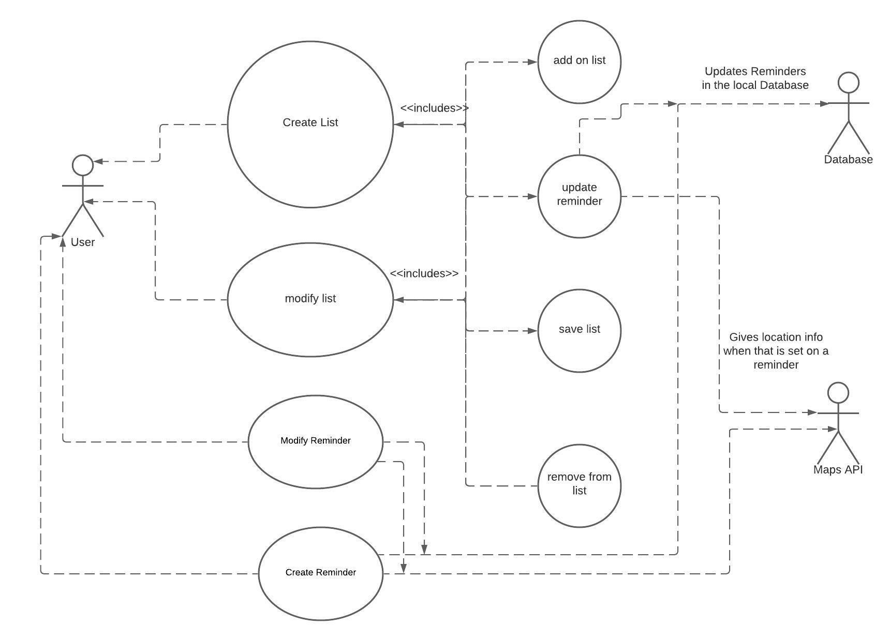

# Use Case Model

**Author**: Group 4

## 1 Use Case Diagram

## 2 Use Case Descriptions

### Create List

Requirements:
 - The user can create a list, give it a name, and add reminders to it. 

Pre-conditions:
 - That there are reminders already created
 - The reminders have a type and then a name

Post-conditions:
 - The list is saved.
 - The list can be modified.
 - Can view reminders by name.
 - The database can look for reminders with similar names.

Scenarios:
 - Normal event sequence: The user creates a list and adds the reminders to the list. They can get the reminders from the existing list of reminders.
 - Alternate event sequence: The user goes to create a list before there are any reminders.
 - Exceptional event sequence: The user saves an empty list

### Modify List

Requirements:
 - The user can add reminders to an existing list, remove reminders, and change the list's name.

Pre-conditions:
 - There is a list already created.

Post-conditions: 
 - The list is saved with the changes.

Scenarios:
 - Normal event sequence: The user selects an already create list and makes their changes to it.
 - Alternate event sequence: The user makes no changes when modifying a list.
 - Exceptional event sequence: The user cancels before saving the changes.

### Modify Reminder

Requirements:
 - The user can select a previously made reminder and change the name, time, and other aspects of it.

Pre-conditions:
 - There are reminders already made.

Post-conditions:
 - The changes are saved.
 - The local database is updated.
 - If the reminder is in a list, the list is also updated.

Scenarios:
 - Normal event sequence: The user selects an already created reminder and makes their changes.
 - Alternate event sequence: The user makes no changes when modifying the reminder.
 - Exceptional event sequence: The user cancels before saving the changes.

### Create Reminder

Requirements:
 - The user can create a reminder, if they want they can set it as a location based reminder. 

Pre-conditions:
 - None. This will be the first thing the user does when starting the app for the first time.

Post-conditions:
 - The reminder is saved.
 - The reminder is saved in the local database.
 - The reminder can be modified.
 - If location based is chosen, the Google Maps API will communicate with the device and app.

Scenarios:
 - Normal event sequence: The user creates the reminder and saves it.
 - Alternate event sequence: The user does not save the reminder.
 - Exceptional event sequence: The user does not give the reminder a name.

### Add on to List

Requirements:
 - Adds the selected reminder to a list.

Pre-conditions:
 - A list is created.
 - At least one reminder is created.

Post-conditions:
 - The reminder is now in the list.

Scenarios:
 - Normal event sequence: The user adds a reminder to an existing list or a list they just created.
 - Alternate event sequence: The user does not add the reminder to a list.
 - Exceptional event sequence: There are no reminders to add.

### Update Reminder

Requirements:
 - The user can update an existing reminder from the list. 

Pre-conditions:
 - There is a list.
 - The reminder is created.
 - The reminder is in the list.

Post-conditions:
 - The database is updated.
 - The changes are saved.
 - The list is also updated.

Scenarios:
 - Normal event sequence: The user selects a reminder from the list, makes their changes, and saves them.
 - Alternate event sequence: The user does not make any changes.
 - Exceptional event sequence: The user does not save their changes.

### Save List

Requirements:
 - The user saves the list, whether new or already created.

Pre-conditions:
 - The list is being edited or created.

Post-conditions:
 - The changes are saved.

Scenarios:
 - Normal event sequence: The user saves the list they were modifying.
 - Alternate event sequence: The user saves, but keeps making changes.
 - Exceptional event sequence: The user does not save their changes.

### Remove from List

Requirements:
 - The user can remove a reminder that they had added to the list.

Pre-conditions:
 - The reminder is already in the list.
 - The list is being edited or created.

Post-conditions:
 - The reminder is no longer in the list.

Scenarios:
 - Normal event sequence: The user removes the selected reminder from the list they are editing.
 - Alternate event sequence: The user does not remove the selected reminder.
 - Exceptional event sequence: The user removes the reminder, but does not save the changes.